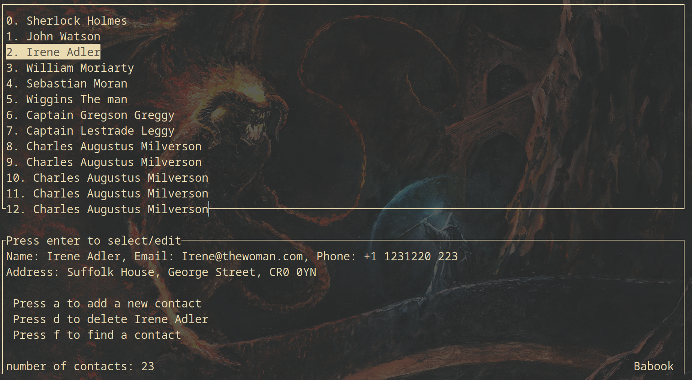
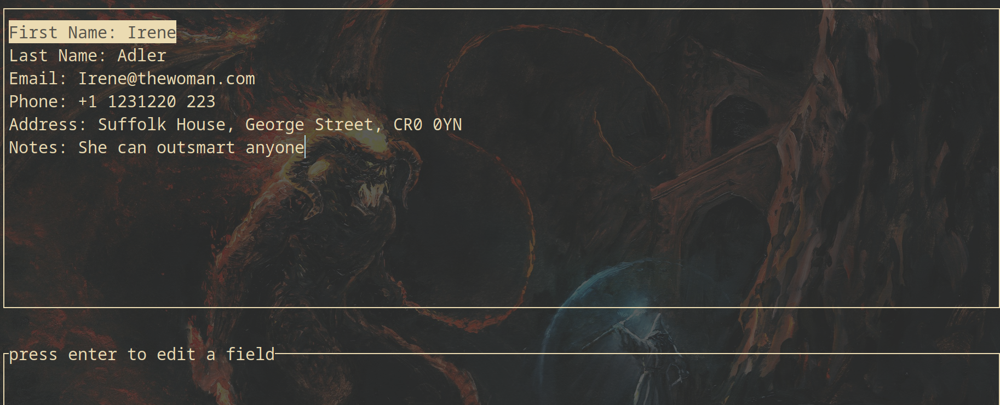
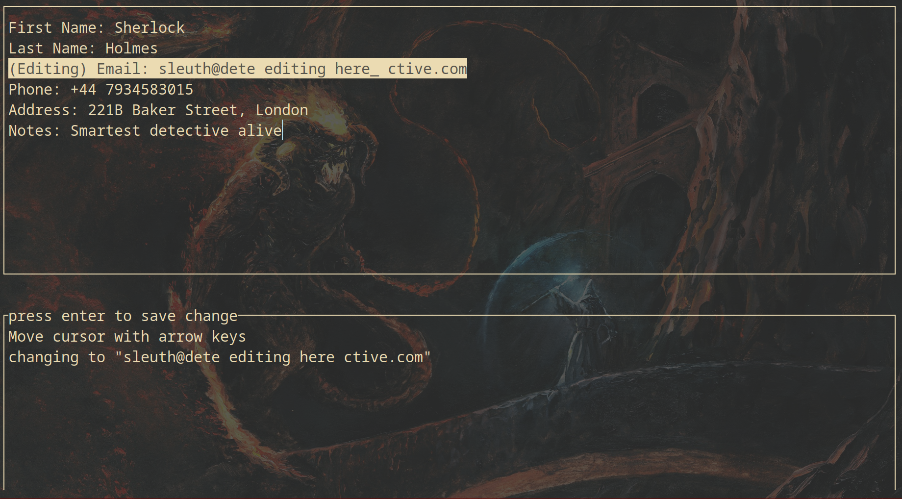
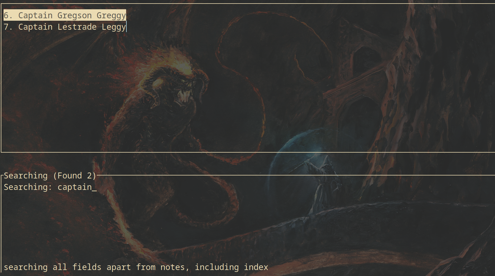

# better_address_book
A better address book written in C. 

Vim keybindings and runs off of a simple csv.

## Quickstart

first, clone the repo
```bash
git clone https://github.com/SherllyNeo/better_address_book.git
```
then 
```bash
cd better_address_book && make && make install 
```
and if you want an example 
```bash
cp example.babook.csv ~/.local/share/babook.csv
```

optionally, you can specify where your address book should be by setting the 
```bash
export ADDRESS_BOOK_PATH="/home/username/babook.csv"
```

If you run it without arguments
```bash
babook
```
it will throw you into the TUI interface

### view all contacts
- view all contacts, with the ability to add and delete them with a summary at the bottom (Screenshot shows a bunch of duplicate contacts as I was testing scrolling)



### view a single contact

### edit a field

### search all contacts 
- can search by any field apart from notes, including index



although it is often good to use the CLI interface for scripting

## Command line Useage

```bash
  ____       _   _                 _       _     _
 | __ )  ___| |_| |_ ___ _ __     / \   __| | __| |_ __ ___  ___ ___
 |  _ \ / _ \ __| __/ _ \ '__|   / _ \ / _` |/ _` | '__/ _ \/ __/ __|
 | |_) |  __/ |_| ||  __/ |     / ___ \ (_| | (_| | | |  __/\__ \__ \
 |____/ \___|\__|\__\___|_|    /_/   \_\__,_|\__,_|_|  \___||___/___/
  ____              _
 | __ )  ___   ___ | | __
 |  _ \ / _ \ / _ \| |/ /
 | |_) | (_) | (_) |   <
 |____/ \___/ \___/|_|\_\

-a or --add to add a new contact
-r or --remove to remove a contact by index
-s or --show to show all contacts
-f or --find to find potential matches
--field to specify fields to show when using -f
-i or --inspect to inspect a specific contact by index
-e or --edit to edit a specific contact by index

acceptable fields are: first_name, last_name, email, phone, address, notes and index


```

## Graphical Useage

Vim keybindings for movement

#### Add new contact 
Press a when highlighting the contact you'd like to delete
#### Remove contact 
Press d when highlighting the contact you'd like to delete
#### Search contacts 
Press f when on the contacts screen and type in a search term
#### Edit contact fields
Press enter or l on a contact to view it, then enter or l to edit a specific field

You can use arrowkeys to move cursor within a string


### Technical notes
* All contacts are stored in a csv that is parsed using my [CSV parser](https://github.com/SherllyNeo/dsvParser/tree/main).
* All of this is just a nice interface for interacting with the csv file, meaning your contacts are portable.


